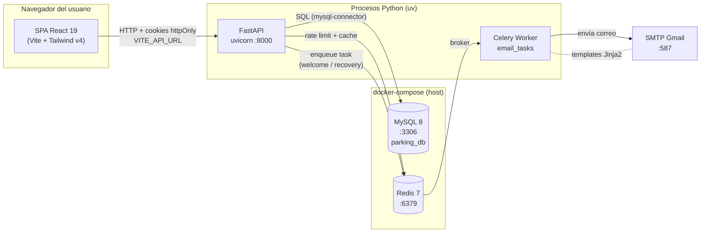
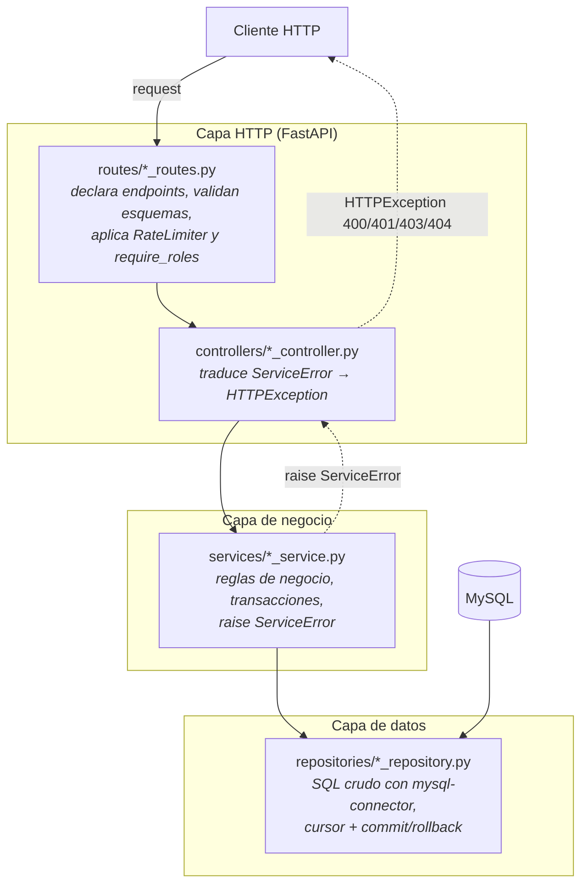
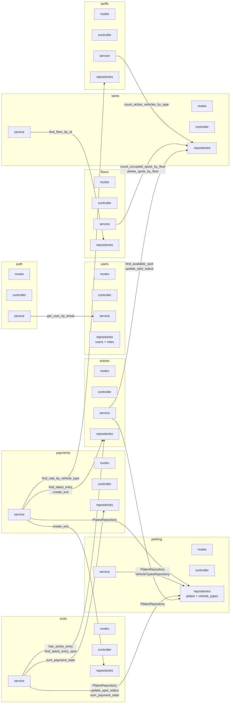
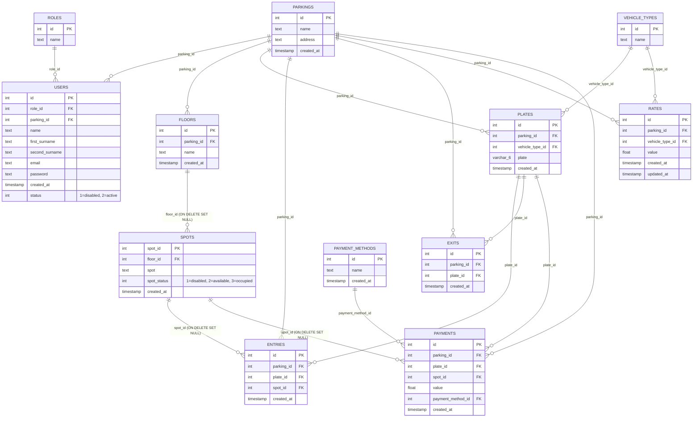
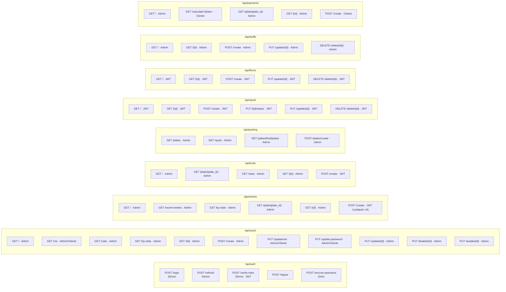
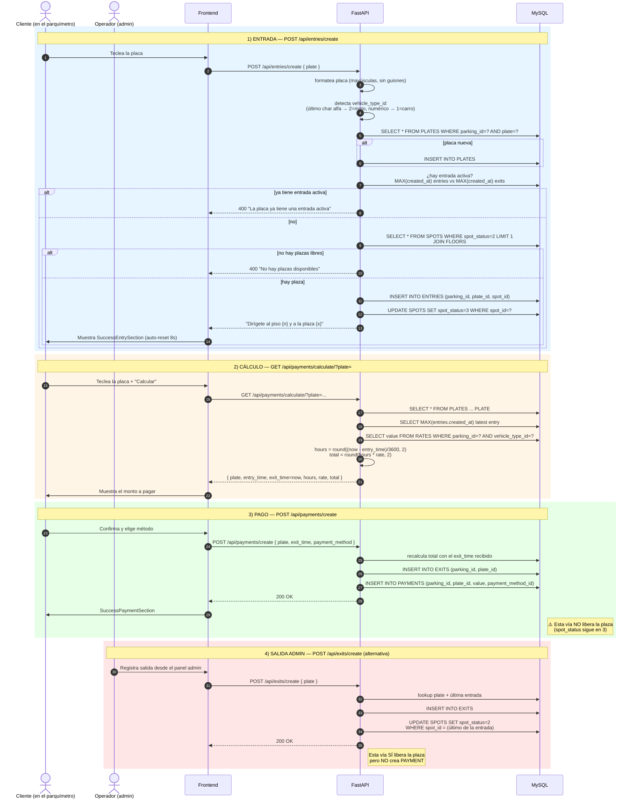
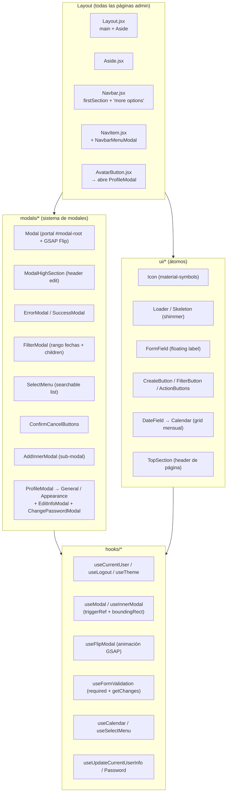
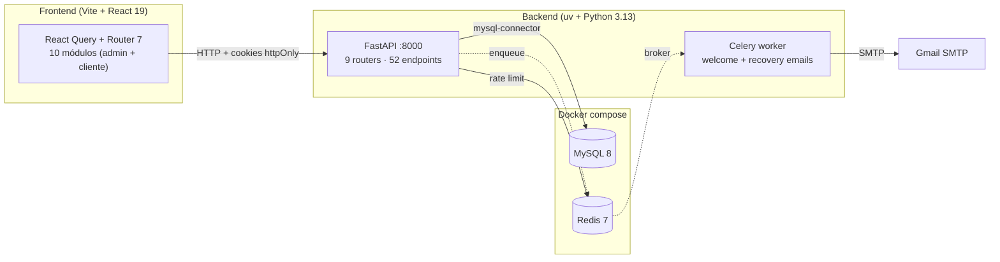

# Arquitectura — parking-hackathon

Mapas y diagramas de la arquitectura completa del proyecto (backend + frontend + base de datos + infraestructura). Los diagramas están escritos en [Mermaid](https://mermaid.js.org/) y se renderizan automáticamente en GitHub, GitLab, VS Code (con la extensión) y la mayoría de visores de Markdown.

---

## 1. Vista de infraestructura / despliegue

Cómo se levantan los procesos y cómo se comunican entre sí en desarrollo y producción.



**Notas:**

- `docker-compose.yml` solo levanta **MySQL** y **Redis**. FastAPI y Celery se ejecutan fuera de Docker con `uv run` y `celery -A app.core.celery_app worker`.
- CORS en FastAPI está restringido a `http://localhost:5173` (el dev server de Vite).
- Las credenciales nunca viajan en el body: el frontend usa **cookies httpOnly** (`access_token` con path `/`, `refresh_token` con path `/api/auth/refresh`).

---

## 2. Arquitectura del backend — capas

El backend sigue una arquitectura en capas estricta. La regla es: **routes → controller → service → repository → MySQL**. Ninguna capa se salta a la siguiente.



**Reglas:**

- `routes` registra endpoints, aplica `RateLimiter(times=N, seconds=60)` y `Depends(verify_jwt)` / `Depends(require_roles([...]))`.
- `controllers` son **thin**: reciben los datos ya validados, llaman al servicio y mapean `ServiceError.message` a un código HTTP.
- `services` no conocen FastAPI; lanzan `ServiceError(message)`. Aquí viven las reglas ("¿hay plaza libre?", "¿la placa ya tiene entrada activa?", etc.).
- `repositories` ejecutan SQL parametrizado y devuelven diccionarios o tuplas. No hay ORM.
- `models/*_schemas.py` define los **inputs** (request bodies) y `models/*_responses.py` los **outputs**.

---

## 3. Mapa de features del backend

Nueve features, todas con la misma estructura interna.



**Multi-tenant:** cada llamada autenticada carga `parking_id` del usuario en el JWT (vía `verify_jwt`) y lo inyecta en cada query como filtro `WHERE parking_id = %s`. Esto aísla los datos entre parkings.

---

## 4. Modelo de datos (ER)

Las 12 tablas de `db/parking_db_ddl.sql` y sus relaciones.



**Códigos de estado relevantes:**

- `USERS.status`: `1` = deshabilitado, `2` = activo.
- `SPOTS.spot_status`: `1` = deshabilitada, `2` = disponible, `3` = ocupada.

---

## 5. Árbol del frontend (SPA)

```mermaid
flowchart TD
    Main["main.jsx<br/>QueryClientProvider"] --> App["App.jsx<br/>BrowserRouter + #modal-root"]
    App --> Router["AppRouter.jsx<br/>Routes"]

    Router --> Login["/login<br/>(público)"]
    Router --> Protected["rutas protegidas<br/>(ProtectedRoutes)"]

    subgraph ProtectedRoutes["ProtectedRoutes.jsx<br/>useCurrentUser + hasRole"]
        direction TB
        Protected --> HomeAdmin["/home · Admin"]
        Protected --> UsersAdmin["/users · Admin"]
        Protected --> EntriesAdmin["/entries · Admin"]
        Protected --> ExitsAdmin["/exits · Admin"]
        Protected --> ParkingAdmin["/parking · Admin"]
        Protected --> TariffsAdmin["/tariffs · Admin (stub)"]
        Protected --> FinanceAdmin["/finance · Admin (stub)"]
        Protected --> CheckInCliente["/check-in · Cliente"]
        Protected --> VehiclePay["/vehicle-payment · Cliente"]
    end

    Login --> LoginPage["LoginPage<br/>LoginForm · LoginButtons<br/>ErrorModal · RecoverPasswordModal"]

    HomeAdmin --> HomePage["HomePage<br/>Layout + HomeSectionsContainer<br/>(SpotsPanel · RecentEntries · Earnings)"]
    UsersAdmin --> UsersPage["UsersPage<br/>TopSection · UsersKpis · UsersTable<br/>+ 4 modales (CRUD + enable/disable)"]
    EntriesAdmin --> EntriesPage["EntriesPage<br/>TopSection · EntriesKpis · EntriesTable<br/>+ CreateEntryModal + FilterModal"]
    ExitsAdmin --> ExitsPage["ExitsPage<br/>TopSection · ExitsKpis · ExitsTable<br/>+ CreateExitModal + FilterModal"]
    ParkingAdmin --> ParkingPage["ParkingPage<br/>Layout + ParkingSectionsContainer<br/>(Spots · Floors · Tariffs) + 6 modales"]
    TariffsAdmin --> TarrifsStub["TarrifsPage (vacío)"]
    FinanceAdmin --> FinanceStub["FinancePage (vacío)"]
    CheckInCliente --> CheckInPage["CheckInPage<br/>CreateEntrySection ↔ SuccessEntrySection"]
    VehiclePay --> VehiclePayment["VehiclePayment<br/>CalculatePaymentSection<br/>CreatePaymentSection<br/>SuccessPaymentSection"]

    subgraph Globals["src/globals (compartido)"]
        G1["hooks: useCurrentUser, useTheme,<br/>useLogout, useModal, useInnerModal,<br/>useFormValidation, useFlipModal, ..."]
        G2["services: getCurrentUser,<br/>logout, updateCurrentUserInfo, ..."]
        G3["components/ui: Icon, Loader, Skeleton,<br/>FormField, CreateButton, FilterButton,<br/>ActionButtons, DateField, Calendar,<br/>TopSection"]
        G4["components/modals: Modal (GSAP Flip),<br/>ModalHighSection, ErrorModal, SuccessModal,<br/>FilterModal, SelectMenu, ConfirmCancelButtons,<br/>ProfileModal (+ EditInfo + ChangePassword)"]
        G5["components/Layout: Layout + Aside + Navbar<br/>(sticky bottom nav, avatar → ProfileModal)"]
    end

    HomePage -. usa .-> G5
    HomePage -. usa .-> G3
    HomePage -. usa .-> G4
    UsersAdmin -. usa .-> G3
    UsersAdmin -. usa .-> G4
    ProtectedRoutes -. usa .-> G1
    Login -. usa .-> G2

    subgraph ServiciosGlobales["Servicios HTTP (uno por feature)"]
        direction LR
        S1["services/login + recoverPassword<br/>(fetch crudo, sin wrapper)"]
        S2["services/users (10 endpoints)"]
        S3["services/entries · exits · spots<br/>floors · tariffs · payments"]
    end

    Login --> S1
    UsersAdmin --> S2
    EntriesAdmin --> S3
    ExitsAdmin --> S3
    ParkingAdmin --> S3
    VehiclePay --> S3

    subgraph Utils["src/utils"]
        U1["fetchWithAuth<br/>(401 → /auth/refresh → retry una vez)"]
        U2["buildQueryParams"]
        U3["formatDateTime / formatTime / months"]
    end

    S2 --> U1
    S3 --> U1
    S1 -. "fetch directo" .-> U1
```



**Stack:** React 19 + Vite 8 + Tailwind v4 + React Router v7 + TanStack Query 5 + GSAP 3 (Flip para animar modales) + Recharts 3 (cargado pero sin uso real en `EarningsChart`).

**Estado global:** solo `QueryClient` (sin Redux/Zustand/Context). El usuario actual vive en `["currentUser"]` y se invalida al hacer login/logout/editar perfil.

---

## 6. Mapa completo de endpoints REST

Todos los recursos. La base es `http://localhost:8000/api`.



**Totales:** 5 auth + 11 users + 6 entries + 5 exits + 4 parking + 6 spots + 5 floors + 5 tariffs + 5 payments = **52 endpoints** de feature + 2 de sistema (`/`, `/ping-db`).

**Rate limiting:** todos los endpoints llevan `RateLimiter(times=N, seconds=60)`. Los más agresivos: `recover-password` 3/min, `entries/create` y `users/create` 10/min, `spots/` 300/min.

---

## 7. Flujo de autenticación

```mermaid
sequenceDiagram
    autonumber
    actor U as Usuario
    participant FE as Frontend (React)
    participant API as FastAPI
    participant DB as MySQL
    participant R as Redis

    U->>FE: Introduce email + password
    FE->>API: POST /api/auth/login<br/>(credentials: include)
    API->>DB: SELECT * FROM USERS WHERE email = ?
    DB-->>API: usuario + hash bcrypt
    API->>API: verify_password(plain, hash)
    alt credenciales OK
        API->>API: create_access_token(sub, role, exp 15m)<br/>create_refresh_token(exp 7d)
        API-->>FE: 200 OK + Set-Cookie:<br/>access_token (path=/, httponly)<br/>refresh_token (path=/api/auth/refresh, httponly)
        FE->>API: GET /api/users/me<br/>(cookie access_token)
        API->>DB: SELECT role_id, parking_id FROM USERS
        API-->>FE: { user_id, role, parking_id }
        FE->>FE: navigate("/home" | "/check-in") según rol
    else credenciales inválidas
        API-->>FE: 401 "Credenciales invalidas"
        FE->>U: Abre ErrorModal
    end

    Note over API,R: FastAPILimiter incrementa contador en Redis<br/>para el rate limit (30/min en /login)

    rect rgb(245, 245, 245)
    Note over FE,API: Petición autenticada posterior
    FE->>API: GET /api/X (cookie access_token)
    alt token válido
        API-->>FE: respuesta normal
    else token expirado (401)
        FE->>API: POST /api/auth/refresh<br/>(cookie refresh_token)
        alt refresh OK
            API-->>FE: nuevas cookies access + refresh
            FE->>API: reintenta la request original
        else refresh falla
            FE->>FE: window.location = "/login"
        end
    end
```

**Decisión clave:** el frontend **nunca** lee el JWT. Todo viaja en cookies httpOnly. `fetchWithAuth` envuelve cada llamada: si llega 401, llama a `/auth/refresh` una sola vez (compartiendo `refreshPromise` con llamadas concurrentes) y reintenta.

---

## 8. Flujo del dominio — Entrada, cobro y salida

El ciclo de vida principal del producto.



**Punto de fricción detectado:** existen dos caminos para cerrar un vehículo — `payments/create` (que crea EXITS + PAYMENTS pero deja la plaza ocupada) y `exits/create` (que crea EXITS y libera la plaza pero sin pago). En la práctica, el flujo del cliente solo registra el cobro; un operador debe liberar la plaza después, o la app necesita una reconciliación.

---

## 9. Mapa de componentes globales reutilizables



**Sistema de modales — pieza más distintiva del frontend:** cada `<Modal>` se abre animando desde el `boundingRect` del elemento que lo disparó (morphing con GSAP Flip) y se cierra volviendo al mismo punto. `location` y `growDirection` parametrizan la posición final (centro, esquinas, anclado al disparador). Las modales anidadas usan `useInnerModal` + `<AddInnerModal>`.

---

## 10. Resumen de una sola vista



| Capa | Tecnología | Responsabilidad |
|---|---|---|
| **Cliente** | React 19, Vite 8, Tailwind v4, React Router 7, TanStack Query 5, GSAP 3 | UI, fetch con cookies, animaciones de modales, sin estado global (solo React Query) |
| **API** | FastAPI, Pydantic v2, Pydantic-Settings, PyJWT, bcrypt | Endpoints REST, validación, JWT, rate limit (Redis) |
| **Workers** | Celery 5 + Redis broker + FastMail + Jinja2 | Emails transaccionales (bienvenida, recuperación) |
| **Persistencia** | MySQL 8 (utf8mb4) + mysql-connector-python | 12 tablas, multi-tenant por `parking_id`, índices por FK |
| **Cache / broker** | Redis 7 | Rate limiting + broker de Celery |
| **Auth** | JWT HS256 (access 15m, refresh 7d) en cookies httpOnly | `verify_jwt` carga `user_id`, `role`, `parking_id` y lo inyecta en cada request |
